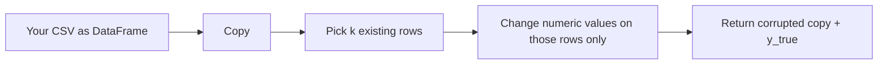

# Synthetic scenarios — what they do and real-world analogies

This page answers: **Does injection add new rows to my CSV?** and maps each scenario to **plausible real situations**. For **HTTP** preview (same parameters as the UI), see **`POST /synthetic-preview`** in [USAGE.md](USAGE.md). For Python helpers (`inject`, metrics), see the **Synthetic evaluation** section there too.

---

## Does your CSV get “extra anomaly rows”?

**No.** `inject()` does **not** append new data points (new rows) to your file.

What happens:

1. Your table is **copied** (`out = df.copy()`). Your original `DataFrame` / file on disk is **not** modified.
2. A random subset of **existing row indices** is chosen (controlled by `contamination` and `random_seed`).
3. For those rows only, **numeric cells** are changed (spike, shift, or scale). Non-numeric columns (e.g. text IDs) stay identical on those rows.
4. `y_true[i] == 1` means “we **artificially perturbed** row *i* for evaluation”; `0` means “left as in your input (for that row).”

So the anomaly is **injected into existing rows**, not by inserting a brand-new row at the bottom of the sheet. (Appending synthetic rows could be a future extension, but it is not what the current code does.)



---

## Scenario cheat sheet

| Scenario ID | What changes (mechanism) | Real-life style analogy |
|-------------|---------------------------|-------------------------|
| `spike_single` | Adds a large offset to **one** numeric column on injected rows (size ∝ column std × `magnitude_in_std`). | **Single-sensor glitch:** one CPU probe spikes; one payment field typo; one link shows huge latency while others stay normal. |
| `joint_shift` | Adds an offset to **several** numeric columns on the same rows. | **Coordinated burst:** CPU and memory and network counters rise together (misbehaving job); fraud ring bumps multiple related signals at once. |
| `scale_burst` | **Multiplies** several numeric columns by `scale_factor` on injected rows. | **Wrong unit / miscalibration:** values read 3× too high after bad scaling; currency amount and fee both inflated by same multiplicative error. |

These are **toys for benchmarking** (known ground truth). They are not a full simulation of fraud or physics—only controlled stress so you can measure precision/recall/F1 against `y_true`.

---

## Example CSVs (`data/synthetic_examples/`)

The committed CSVs in **`data/synthetic_examples/`** are **clean baselines** for demos: they are **not** pre-corrupted. To see a perturbation:

- **No script:** open the dashboard at **`http://127.0.0.1:8000/ui/`**, load one of these files, and use **Synthetic anomaly (preview)** (`POST /synthetic-preview` — see [USAGE.md](USAGE.md)).
- **Python:** call `inject()` as below.

| File | Idea |
|------|------|
| [../data/synthetic_examples/baseline_server_metrics.csv](../data/synthetic_examples/baseline_server_metrics.csv) | Server-style metrics: CPU, memory, latency (numeric). |
| [../data/synthetic_examples/baseline_sensor_readings.csv](../data/synthetic_examples/baseline_sensor_readings.csv) | Three sensors + optional `device_id` string (strings are not modified by injection). |

Example (run from `api/` with `PYTHONPATH` or `cd api`):

```python
import pandas as pd
from synthetic_injection import inject

df = pd.read_csv("../data/synthetic_examples/baseline_server_metrics.csv")
corrupted, y_true = inject(df, "spike_single", random_seed=42, params={"column": "latency_ms"})
corrupted.to_csv("../results/demo_after_spike.csv", index=False)  # ensure ../results exists
```

`demo_after_spike.csv` is **optional local output** (the `results/` folder is gitignored except `.gitkeep`).

---

## Visual: single-column spike (concept)

See [images/spike_concept.svg](images/spike_concept.svg): one metric jumps on a few time steps while the rest stay in band—similar idea to `spike_single` on one column.

---

## Mental model vs. the rest of the project

- **Injection:** builds **known** labels `y_true` by editing numeric values on selected rows.
- **`AdvancedAnomalySystem`:** does **not** read `y_true`; it scores the corrupted table and predicts `is_anomaly`. You compare `y_true` vs `is_anomaly` in benchmarks (small Python snippet, notebook, or a future `experiments/` runner—not committed here to keep the repo small).

If you need **real** anomalies only from the field, you still use your CSV as-is; injection is optional tooling for **evaluation and professor-requested robustness studies**.
